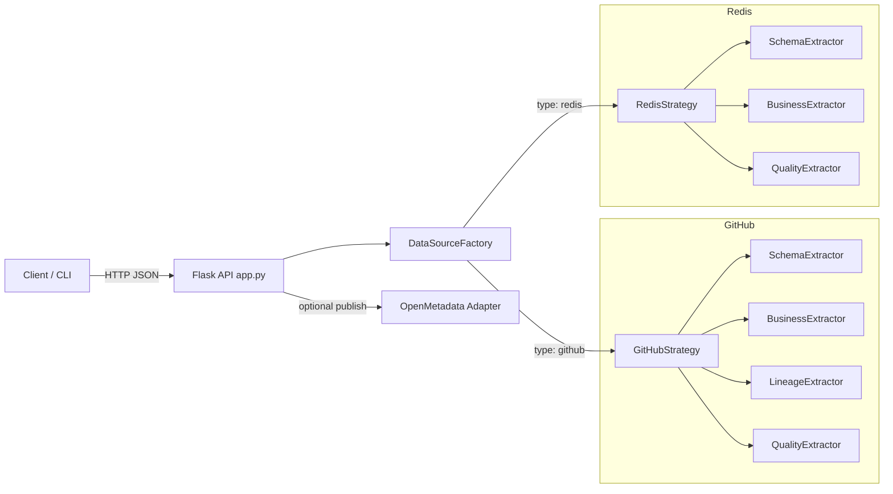

# Architecture Overview

## Goals
- Build a pluggable metadata extractor with consistent outputs across sources.
- Separate core concerns: schema, business context, lineage, quality.
- Provide a simple local API runtime with optional catalog publishing.
- Make extension to new sources trivial and low-risk.

## High-Level Design
- **Strategy Pattern**: Each source implements `DataSourceStrategy` (`datasource/base.py`) with:
  - `extract_schema()`, `extract_business_context()`, `extract_lineage()`, `extract_quality_metrics()`
- **Factory Pattern**: `DataSourceFactory` (`datasource/factory.py`) maps `config['type']` → strategy.
- **Per-extractor composition**: Each `strategy.py` delegates to focused extractors in `extractors/`.
- **API-first runtime**: `app.py` exposes `POST /extract` to run any subset of extractors.
- **Optional publishing**: `integrations/openmetadata_adapter.py` maps outputs to OpenMetadata.



## Source Implementations

### GitHub (`datasource/github/`)
- **Strategy**: `datasource/github/strategy.py`
- **Extractors**:
  - `extractors/schema.py`: Field lists for `repository`, `issue`, `pull_request` (logical data model for downstream use).
  - `extractors/business.py`: `description`, `homepage`, `default_branch`, `license`, `topics` from repo — human context and taxonomy.
  - `extractors/lineage.py`: Fork graph edges (parent → fork, fork → children) — a practical relationship graph for repos.
  - `extractors/quality.py`: Popularity/health proxies: stars, forks, watchers, issue/PR counts, average issue close time.
- **Why**: Emphasize governance, maintainability signals, and discoverability.

### Redis (`datasource/redis/`)
- **Strategy**: `datasource/redis/strategy.py`
- **Extractors**:
  - `extractors/schema.py`: Key samples (key/type/ttl), `type_counts`, `prefix_counts` via SCAN — structural proxy for schemaless KV.
  - `extractors/business.py`: `prefix_tags` from config and per-prefix key counts — injects business semantics from naming conventions.
  - `extractors/quality.py`: `total_keys`, expiring vs persistent via TTL, sampled type counts — quick health snapshot.
  - Lineage: N/A → `{ "edges": [] }`.
- **Why**: No rigid schema; focus on keyspace structure, naming patterns, and TTL posture.

## API Layer (`app.py`)
- `GET /health` → liveness.
- `POST /extract` → body:
```json
{
  "config": { "type": "github" | "redis", ... },
  "flags": { "schema": true, "business": true, "quality": true, "lineage": true, "all": false },
  "publishOpenMetadata": false,
  "openMetadataConfig": { ... }
}
```
- Supports `configPath` / `openMetadataConfigPath` as file-based alternatives.

## Configuration
- Examples:
  - GitHub: `datasource/github/config.example.yaml`
  - Redis: `datasource/redis/config.example.yaml`
- Secrets: prefer env (e.g., `GITHUB_TOKEN`) or secret managers (not committed).

## Error Handling & Resilience
- GitHub: centralized `_get()` with headers, token support; callers handle JSON safely. Can be extended with timeouts/backoff/pagination.
- Redis: SCAN iteration with `scan_count` and per-key try/except to avoid hotspots or permission issues.
- API: returns `400` with `{ "error": "..." }` on invalid input.
- Publishing: lazy import of OM client; clear error if not installed.

## Observability & Security
- Minimal logging for take-home; can be extended with structured logs and request IDs.
- No secrets logged; configs read from payload or files. Tokens recommended via env variables.

## Testing
- `tests/test_github_strategy.py`: schema, business, lineage, quality via monkeypatched `_get()`.
- `tests/test_factory.py`: factory returns correct strategies for GitHub and Redis.
- `tests/conftest.py`: ensures project root on `sys.path`.

## Extensibility
- Add a source:
  1. Create `datasource/<source>/strategy.py` + `extractors/`.
  2. Implement the four extractor methods (or return N/A for non-applicable ones).
  3. Map it in `datasource/factory.py`.
- Add an extractor type:
  - Implement an extractor class and delegate from the source’s `strategy.py`.

## Future Enhancements
- GitHub: pagination for completeness; retry/backoff on rate limits; timeouts.
- Redis: per-type value sampling (list length, set size); optional MEMORY USAGE where permitted.
- API: request validation (pydantic), auth, structured logging.
- Publishing: robust type mapping, idempotent upserts, batching.

## Key Files
- `datasource/base.py` — strategy interface.
- `datasource/factory.py` — type → strategy mapping.
- `datasource/github/`, `datasource/redis/` — strategies + extractors per concern.
- `app.py` — Flask API.
- `integrations/openmetadata_adapter.py` — optional OpenMetadata publisher.
